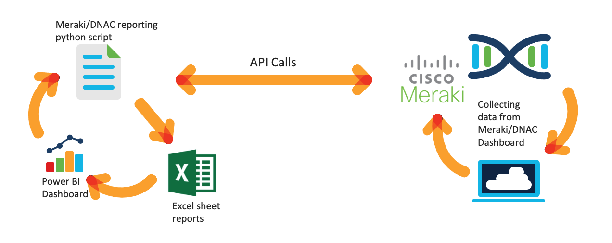
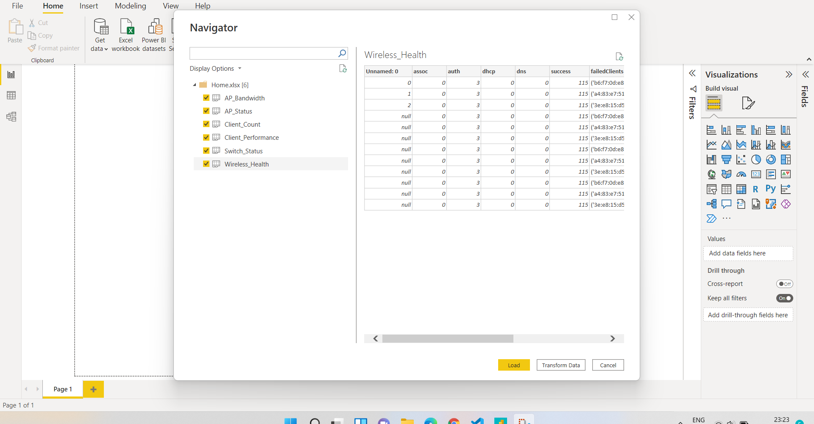
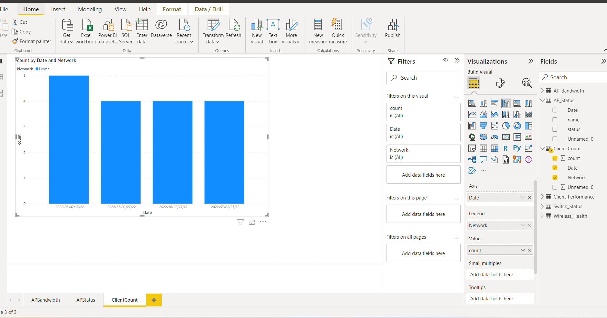

# Meraki/ DNAC Power BI Insights Dashboard

This project demonstrates leveraging Meraki and Cisco DNA-Center APIs
to create custom reports using Python that illustrates specific use-cases for Power BI visualization. 

## Cisco Contacts
* Swati Singh ( swsingh3@cisco.com)

## Requirements

- Cisco DNA-Center Instance v1.3.1 or later
- Cisco Meraki 
- Python 3.8 or later
- Microsoft Excel
- Microsoft Power BI

## Set UP

1) Download and Unzip the folder or Clone the git repository

2) Enter the keys and account credentials in [config](./config.py) file
    - api_key = 'ENTER MERAKI API KEY HERE'
    - base_url='ENTER BASE URL'
    - dnac_username="ENTER DNAC USERNAME HERE"
    - dnac_password = 'ENTER DNAC PASSWORD HERE'

3) Create a Python 3 virtual environment and activate it.
    - MacOS or Linux:
    >python3 -m venv venv                                                                               
     source venv/bin/activate  
                                                                                                                
    - Windows git-bash
    >py -3 -m venv venv                                                                      
    source venv/Scripts/activate
        
4) Install the lab requirements.
    >pip3 install -r requirements.txt
    
 
## Run
1) For DNA Reports, run the following command:
    >python3 dnaHealthReport.py
    
Note: This can take a few minutes depending on the DNA-Center's Rate limiting per API endpoint
   - Range between 5-100/minute

2) For Meraki Reports, run the following command: 
    >python3 meraki_app.py

3) Once the reports the generated, visualize the data on Power BI as follows:

    1. Set up a data source, choose "Import data from excel" and select the file

        

    2. Load and trasnform the data

        

    3. Select the metrics for visualizations from "Fields" on the RHS 

        

    4. Similary, create more  dashboards for all different metrices for all the networks 
       * Ex: Client Count of a network 

        

NOTE: Click on the "Refresh" button under "Home" tab in order to update the data source and load new data in Power BI

### API Reference/Documentation:
* Meraki APIs [Here](https://developer.cisco.com/meraki/api-v1/)
* DNA-Center Intent API [HERE](https://developer.cisco.com/docs/dna-center/api/1-3-3-x/)

